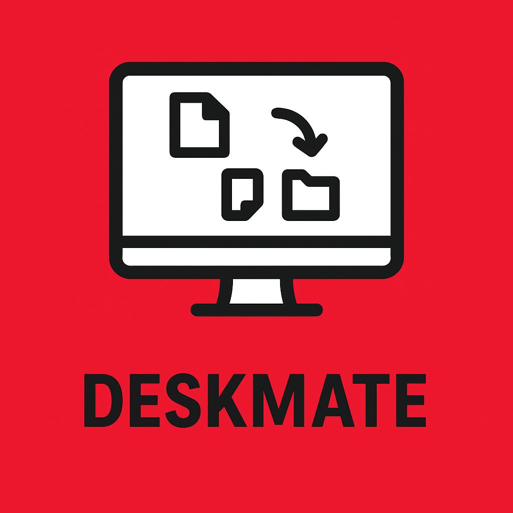
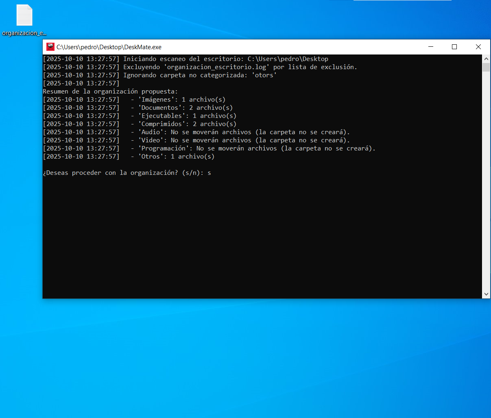
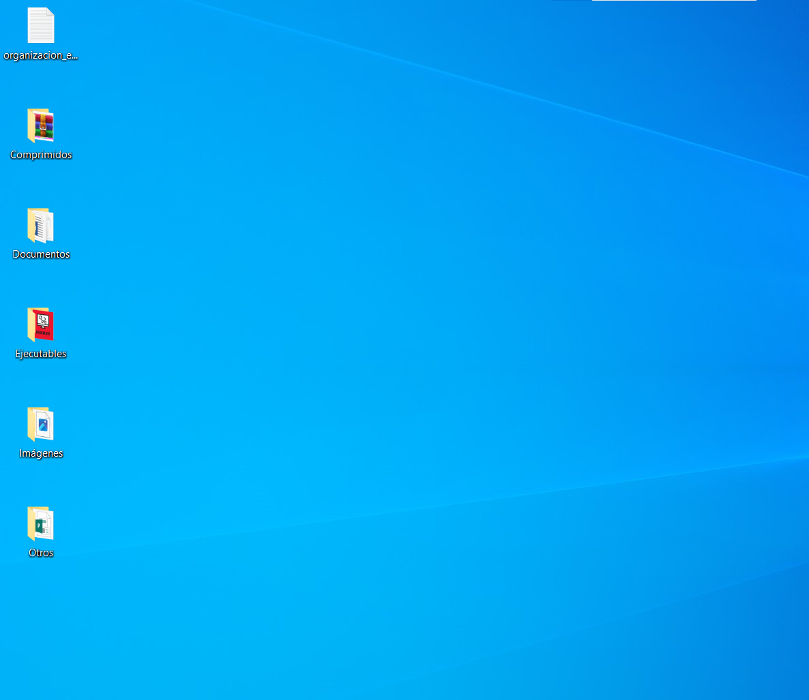
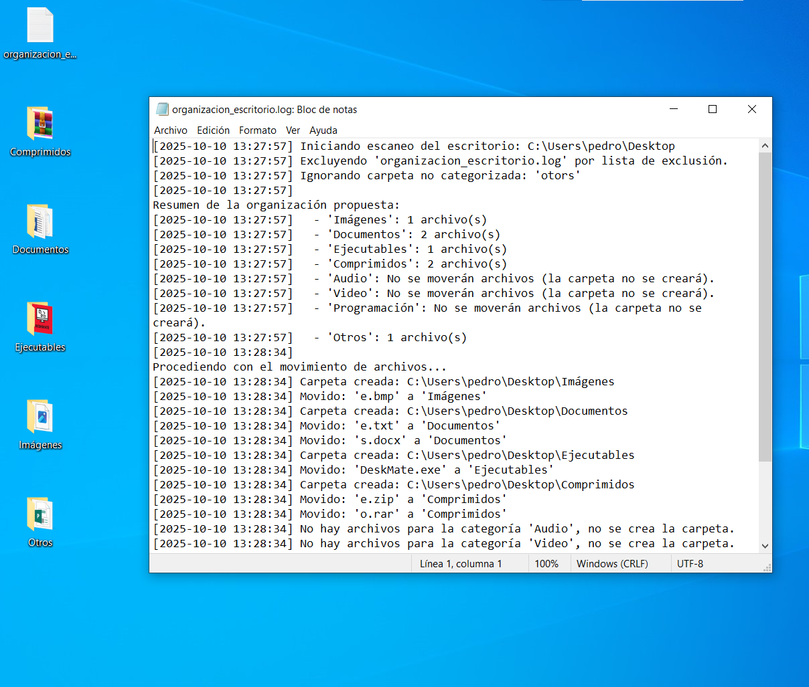

<p style="text-align: right; margin-bottom: 20px;">
  <!-- Bandera de Estados Unidos para inglés -->
  <a href="README.en.md" style="text-decoration: none; margin-left: 10px;" title="English">
    
  </a>
  <!-- Bandera de España para español -->
  <a href="README.md" style="text-decoration: none; margin-left: 10px;" title="Español">
    
  </a>
</p>

# DeskMate 🚀


<!-- Si no tienes un logo, puedes eliminar la línea anterior o usar un icono genérico. -->

DeskMate es una herramienta diseñada para mantener tu escritorio organizado automáticamente. Clasifica y mueve archivos a carpetas predefinidas según su tipo, y registra todas estas acciones en un archivo de texto (log) para que siempre tengas un historial detallado de la organización de tu espacio de trabajo.

<h2 align="center">Demostración</h2>

<p align="center">
  Aquí puedes ver la herramienta en acción a través de GIFs y capturas de pantalla.
</p>

### GIF de la Herramienta en Funcionamiento

<p align="center">
  
  <em>Una rápida demostración del flujo de trabajo principal de la DeskMate, mostrando sus características clave.</em>
</p>

### Capturas de Pantalla Clave

<p align="center">
  
  <em>Escritorio desordenado.</em>
</p>

<p align="center">
  
  <em>Ejecutamos la herramienta para ordenar el escritorio.</em>
</p>

<p align="center">
  
  <em>Una vez confirmada la ejecución de la herramienta veremos el escritorio ordenado.</em>
</p>

<p align="center">
  
  <em>Logs generados por la herramienta.</em>
</p>

---

## Características

*   **Organización Automática:** Clasifica y mueve archivos del escritorio a carpetas designadas según su tipo (ej., documentos, imágenes, ejecutables).
*   **Registro Detallado (Log):** Genera un archivo de texto (`log`) con el historial completo de todos los movimientos y acciones realizadas, permitiendo un seguimiento preciso.
*   **Compatibilidad:** Optimizada para entornos Windows x64.

## Estructura del Proyecto

Este repositorio contiene la herramienta **CySortify** y sus archivos asociados.
```bash
DeskMate/
├── DeskMate.py
├── DeskMate.spec  
├── README.md
└── README.en.md
```
---

## Documentación Adicional

Aquí encontrarás información más detallada sobre el proyecto:

*   🤝 [**Código de Conducta**](CODIGO_DE_CONDUCTA.md) - Normas para una comunidad respetuosa.
*   📬 [**Cómo Contribuir**](COMO_CONTRIBUIR.md) - Pasos para colaborar con el proyecto.
*   🔐 [**Seguridad**](SEGURIDAD.md) - Información sobre cómo reportar vulnerabilidades.
*   ⚠️ [**Aviso Legal**](AVISO_LEGAL.md) - Cláusulas y advertencias legales importantes.
*   📢 [**Soporte**](SOPORTE.md) - Dónde obtener ayuda o hacer preguntas.

---

## 🚀 Guía Rápida de Uso e Instalación

```bash
# PASOS GENERALES PARA OBTENER EL PROYECTO
git clone https://github.com/D4rkh45h/DeskMate.git
cd DeskMate

# CONFIGURACIÓN DEL ENTORNO VIRTUAL (OPCIONAL, PERO RECOMENDADO)
# Para Windows:
# python -m venv venv
# .\venv\Scripts\activate
#
# Para Linux:
# python3 -m venv venv
# source venv/bin/activate

# --- OPCIONES DE EJECUCIÓN ---

# 🪟 PARA USUARIOS DE WINDOWS (x64):
# Instalación de PyInstaller y Generación del Ejecutable .exe
pip install pyinstaller
pyinstaller --clean --onefile --noconsole --version-file=version.txt --icon=deskmate.ico DeskMate.py
# El ejecutable compilado estará disponible en: DeskMate/dist/DeskMate/DeskMate.exe

# 🐧 PARA USUARIOS DE LINUX:
# Instalación de Dependencias y Ejecución del Script
pip install -r requirements.txt
python3 DeskMate.py
